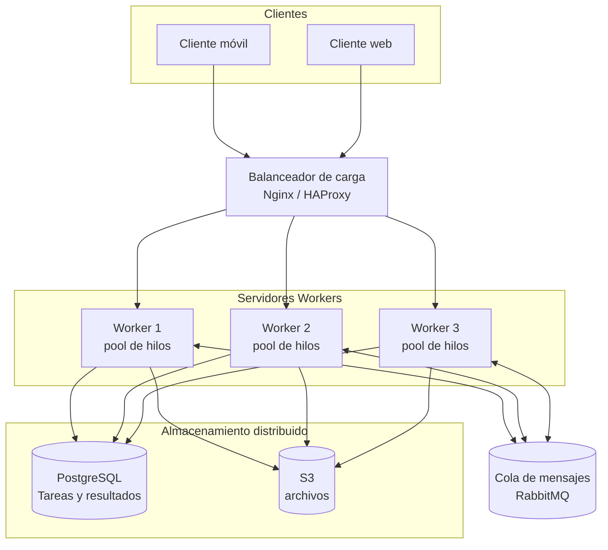

```mermaid
flowchart TB
    subgraph Clientes
        C1["Cliente móvil"]
        C2["Cliente web"]
    end

    LB["Balanceador de carga<br/>Nginx / HAProxy"]

    subgraph Servidores Workers
        W1["Worker 1<br/>pool de hilos"]
        W2["Worker 2<br/>pool de hilos"]
        W3["Worker 3<br/>pool de hilos"]
    end

    subgraph Almacenamiento[Almacenamiento distribuido]
        PG[("PostgreSQL<br/>Tareas y resultados")]
        OBJ[("S3<br/>archivos")]
    end

    C1 & C2 ---> LB 
    LB ---> W1 & W2 & W3
    W1 <--> MQ[("Cola de mensajes<br/>RabbitMQ")]
    W2 <--> MQ
    W3 <--> MQ

    W1 --> PG
    W2 --> PG
    W3 --> PG

    W1 --> OBJ
    W2 --> OBJ
    W3 --> OBJ
```